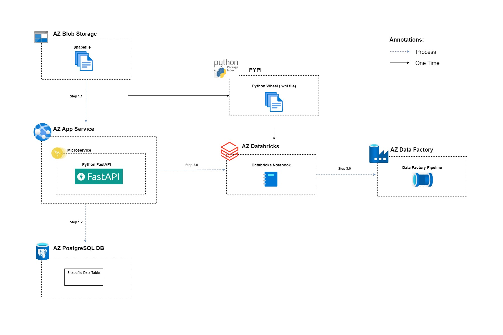

# shapefile-infrastructures

### Process Diagram:



## 1. Deploy Microservice

1.1. Go to the directory,

```shell
fastapi-microservice
```

1.2. Create a conda virtual environment and activate it.

```shell
conda create -n shapefileenv python=3.8 -y
conda activate shapefileenv
```

1.3. Install the dependencies.

```shell
pip install -r requirements.txt
```

1.4. Run the FastAPI application on localhost.

```shell
uvicorn main:app --reload 
```

1.5. POST method to process the sharefile. Please refer this link (`http://127.0.0.1:8000/docs/`) to see the API documentstion.

```shell
uvicorn main:app --reload 
```

1.6 Deploy the FastAPI app in Azure App Services.

```shell
https://as-shapefile-sasia.azurewebsites.net/process-shapefile/
```

## 2. Packaging the Microservice as a Python Wheel

2.1. Go to the directory,

```shell
fastapi-microservice
```

2.2. Package the microservice.

```shell
python setup.py bdist_wheel
```

2.3. Activate the API key for PYPI.

```shell
$env:TWINE_PASSWORD="api-key"
```

2.4. Store the wheel file in PYPI.

```shell
twine upload dist/*
```